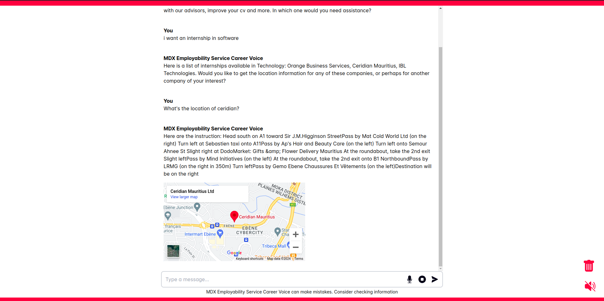
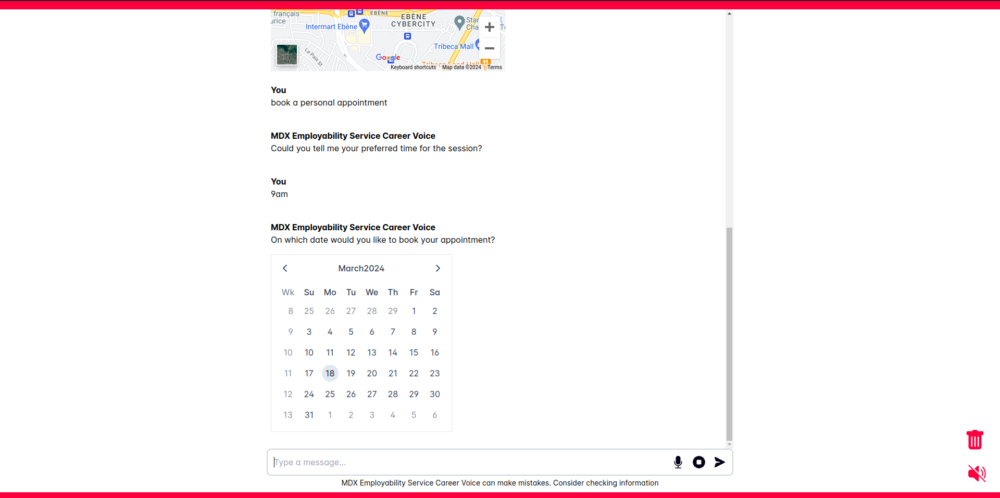

# The MDX Employability Service Career Voice

The proposed Voice User Interface (VUI) system is a chatbot
called MDX Employability Service Career Voice, which will
feature `speech recognition` and `synthesis` with `natural
language understanding (NLU)`.

It will assist the MDX employability service to support to students with quicker access to information and
services with the benefits of voice commands and dialogue-
style conversations, allowing hands-free interactions.

## Features

- Help answer questions
about the employability service, and responses with
URLs will be redirected to the desired page, for example, the
employability service LinkedIn profile.
- Provide a list of companies with internship
opportunities based on the student's field of study.
- Provide a map
and auditory directions to any company of interest.
- Book 1:1 appointments with advisors

## Technology and API used

- [Dialogflow ES](https://dialogflow.cloud.google.com)
- [Node.js Client for Google Maps Services](https://github.com/googlemaps/google-maps-services-js?tab=readme-ov-file)
- [MapsEmbed API](https://developers.google.com/maps/documentation/embed/get-started)
- [Places API](https://developers.google.com/maps/documentation/places/web-service)
- [OpenAI API](https://platform.openai.com/docs/overview)

## Project setup

### Frontend

#### Compiles and hot-reloads for development

```bash
npm install
```

```bash
npm run dev
```

### Backend

```bash
npm install
```

Create `.env` file in `backend/` directory and add the following

```env
DIALOGFLOW_CREDENTIALS = "dialogflow-credentials.json"
OPENAI_API_KEY = "openai-api"
DIALOGFLOW_KNOWLEDGEBASE_ID = "knowledgebase-id"
PORT = 3000
GOOGLE_CALENDAR_ID = "calendar-id"
GOOGLE_MAPS_API_KEY = "maps-api-key"
```

### Dialogflow ES

Create a Dialogflow ES agent and import the `dialogflow/dialogflow-agent.zip` file.

### Dialogflow ES Knowledge Base

Create a Dialogflow ES knowledge base and add the document `dialogflow/employabilityServiceKnowledgeBase`.

### Run REST API and dialog flow webhook server

Install and run [Ngrok](https://ngrok.com/) (unix system) or npm package [localhost](https://www.npmjs.com/package/localhost) or Visual Studio code `Forward a port` feature to expose local server to the internet for Dialogflow webhook.

Example using Ngrok:

```bash
ngrok http 3000
```

Add the exposed local server URL to the Dialogflow ES webhook.


Run the REST API server

```bash
npm run dev
```

## Future Work

- Provide the user's location to the backend server to get the accurate location-based information.

## Screenshots




## Reference

- [Dialogflow API with NodeJS | Dialogflow Detect Intent Example | Dialogflow Custom Integartion](https://www.youtube.com/watch?v=dFN79tEr_bc)
