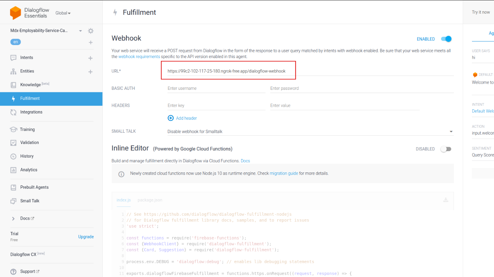

# mdxEmployabilityServiceCareerVoice

[Dialogflow ES](https://dialogflow.cloud.google.com)

Reference: <https://www.youtube.com/watch?v=dFN79tEr_bc>

## Frontend

### Project setup

```bash
npm install
```

### Compiles and hot-reloads for development

```bash
npm run dev
```

## Backend

### Project setup

```bash
npm install
```

Create `.env` file in `backend/` directory and add the following

```env
DIALOGFLOW_CREDENTIALS = "dialogflow-credentials.json"
OPENAI_API_KEY = "openai-api"
```

### Run REST API and dialog flow webhook server

Install and run [Ngrok](https://ngrok.com/) (unix system) or npm [localhost](https://www.npmjs.com/package/localhost) to expose local server to the internet for Dialogflow webhook

```bash
ngrok http 3000
```

Add the exposed local server URL to the Dialogflow ES webhook




Run the server

```bash
npm run dev
```
